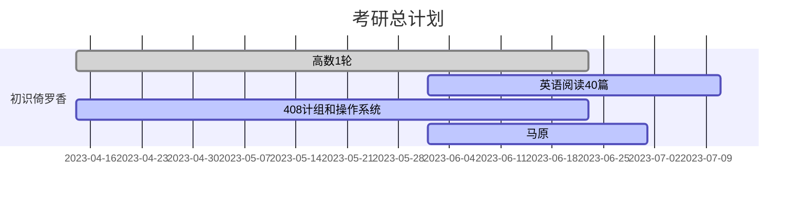

# KaoyanPlan

向日葵的考研计划

冲烂计算机11408

学习管理，充分休息，学习时间抓紧学

一人一团队，兼职开发人员，测试人员，产品经理，项目经理

不要愧对自己和亲朋好友

- [KaoyanPlan](#kaoyanplan)
  - [学习方法](#学习方法)
    - [政治](#政治)
    - [英语](#英语)
    - [数学](#数学)
    - [408](#408)
  - [准则](#准则)
  - [周报](#周报)
  - [月报](#月报)
  - [学习管理表](#学习管理表)
  - [学习节点](#学习节点)
  - [复试准备](#复试准备)
  - [参考仓库](#参考仓库)
    - [数学](#数学-1)
    - [英语](#英语-1)
    - [408](#408-1)

## 学习方法

### 政治

还未开始复习，打算用苍盾考研小程序刷一遍选择题，然后背肖秀荣，听说徐涛讲政治讲的很好

### 英语

识记考研大纲单词，练习考研的阅读和写作，除此之外，提高自己的造句和对话的能力

用“欧路词典”记单词，欧路词典提供了单词库记背，还有识别图片上的单词并添加到生词本的功能。

~~用“每日英语听力”听英语对话~~

前期，想自己探索方法，从根本上提升英语能力，

我认为英语能力本质是对词汇的掌控能力，识记是一方面，运用又是一方面，提升能运用的单词量很重要，我打算交叉练习，一天练习识记看英语阅读，一天练习运用，用英语记录自己的生活，然后用gpt润色，提高单词运用的能力

放在后面做

```
找电子版真题打印，做真题
```

### 数学

全程跟着张宇学，按高数，概率论，线代的顺序复习，复习概率论的时候，每天保证高数的题量，巩固之前的知识体系。

### 408

跟着王道网课走，按计组，操作系统，数据结构，计网的顺序复习，题目可以从王道书和n诺上面找。


## 准则

- 作息
  - 早上 7~8 点起，晨练和早餐，中午 1 点到 2 点休息，晚上 11 点睡，保持作息很重要，我们的意志力依赖一个叫前额皮质的东西，保持良好的饮食和作息，有利于前额皮质工作，不要靠意志力硬学
  - ~~《成为作家》写作训练，早上和一个特定时间训练自己的无意识。~~ 想写的时候写点东西
- 学习方法
  - 按自己的节奏来，不要被市面上的面经吓跑，永远处于一个准备的状态，永远有东西要学，所以保持自己的学习节奏很重要 
  - 不要被单科线拦住了，拒绝偏科，各科抓紧
  - 项目管理不需要太细太紧张，把握每个学习段的节点，将四科学习合理分配，重点放在数学和408上
  - 使用[ambie](https://github.com/jenius-apps/ambie)开环境音学习
- 学习管理
  - 每天 22 点记录日报，每周日 16 点记录周报，~~1，3，5 或者 2，4 早上 9 点审计学习进度，记录学习管理表~~

## 周报

<details>

  <summary>周报详情</summary>

[第一周 04-16](周报/2023-04-16.md)

[第二周 04-23](周报/2023-04-23.md)

[第三周 04-30](周报/2023-04-30.md)

[第四周 05-07](周报/2023-05-07.md)

[第五周 05-14](周报/2023-05-14.md)

[第六周 05-21](周报/2023-05-21.md)

[第七周 05-28](周报/2023-05-28.md)

</details>

## 月报

<details>

  <summary>月报详情</summary>

[5月](月报/5月.md)

</details>

## 学习管理表

<details>

  <summary>学习管理表详情</summary>

[v1.0.0](学习管理表/v1.0.0.md)

[v1.0.1](学习管理表/v1.0.1.md)

[v1.0.2](学习管理表/v1.0.2.md)

[v1.0.3](学习管理表/v1.0.3.md)

</details>

## 学习节点



## 复试准备

[N诺](https://noobdream.com/)


## 参考仓库

### 数学

[Math](https://github.com/Didnelpsun/Math)

### 英语

[KaoYan-English](https://github.com/m2kar/KaoYan-English)

[专为程序员编写的英语学习指南 v1.2](https://github.com/yujiangshui/A-Programmers-Guide-to-English)

### 408

[aimto408](https://github.com/xiaolei565/aimto408)

[CSPostgraduate-408](https://github.com/CodePanda66/CSPostgraduate-408)

[cs-408](https://github.com/ddy-ddy/cs-408)