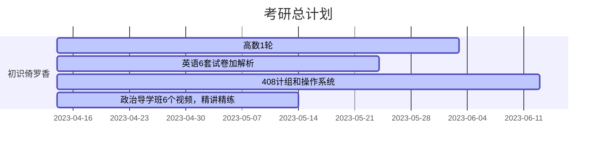

# KaoyanPlan

向日葵的考研计划

今日起兵，选择计算机 11408

学习管理，充分休息，不允许懈怠

一人一团队，兼职开发人员，测试人员，产品经理，项目经理

- [KaoyanPlan](#kaoyanplan)
  - [准则](#准则)
  - [学习节点](#学习节点)
  - [参考仓库](#参考仓库)
    - [数学](#数学)
    - [英语](#英语)
    - [408](#408)

## 准则

- 作息
  - 早上 6 点起，6 点到 8 点晨练和早餐，中午 1 点到 2 点休息，晚上 11 点睡，睡眠充足，克服懈怠
  - 《成为作家》写作训练，早上和一个特定时间训练自己的无意识。
- 学习方法
  - 不要被单科线操作了，拒绝偏科，各科抓紧
  - 项目管理不需要太细，把握每个学习段的节点，将四科学习任务均匀分配，
  - 学习数学，408 疲倦了，交叉学习英语和政治
  - 各科每天学习时长不定，每天必须有英语的学习，之间穿插特殊训练，英语口语，听力的学习，和算法题学习，特殊训练，特殊任务不要花费大量精力，复试再根据复试项目针对训练。
  - 前期（四月-七月）听课占 40%，学习占 60%，（八月-十二月）后期听课 20%，学习占 80%
- 学习管理
  - 每天 22 点记录日报，每周日 16 点记录周报，1，3，5 或者 2，4 早上 9 点审计学习进度，记录学习管理表

## 学习节点

## 参考仓库

### 数学

[Math](https://github.com/Didnelpsun/Math)

### 英语

[KaoYan-English](https://github.com/m2kar/KaoYan-English)

### 408

[aimto408](https://github.com/xiaolei565/aimto408)
