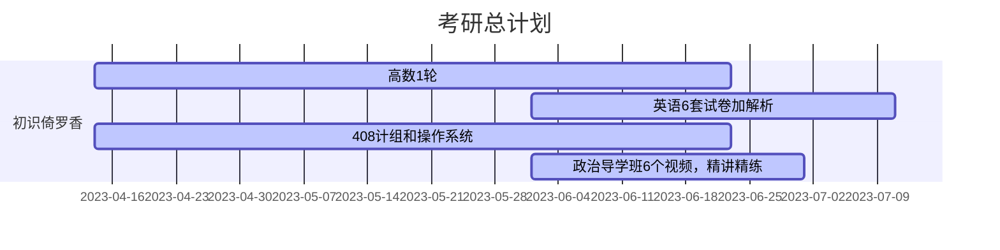

# KaoyanPlan

向日葵的考研计划

今日起兵，选择计算机11408绞肉机

学习管理，充分休息，不允许懈怠

一人一团队，兼职开发人员，测试人员，产品经理，项目经理

不要愧对自己和关注自己的亲朋好友

- [KaoyanPlan](#kaoyanplan)
  - [学习方法](#学习方法)
    - [政治](#政治)
    - [英语](#英语)
    - [数学](#数学)
    - [408](#408)
  - [准则](#准则)
  - [周报](#周报)
  - [学习管理表](#学习管理表)
  - [学习节点](#学习节点)
  - [复试准备](#复试准备)
  - [参考仓库](#参考仓库)
    - [数学](#数学-1)
    - [英语](#英语-1)
    - [408](#408-1)

## 学习方法

### 政治

还未开始复习，打算用苍盾考研小程序刷一遍选择题，然后背肖秀荣

### 英语

正在重整基础，我想练考研题的同时，把自己的口语也练上去。

用“欧路词典”背单词，我发现这个app开发的单词很科学，就是你可以选择考研词库，每天设置多少单词，然后识记，背的中间还会穿插题目巩固记忆，单词有例句，可以听语音

用“每日英语听力”听英语对话

考研题，我还是打算花钱买教辅，我想试试“考研真相”，200多大洋，有点难顶

### 数学

就跟着张宇复习基础，重新学一遍，懂的地方直接做题，不懂的看网课，然后题海战术，数学是题练出来的

### 408

跟王道走，也是多看网课，练习题巩固知识

## 准则

- 作息
  - 早上 6 点起，6 点到 8 点晨练和早餐，中午 1 点到 2 点休息，晚上 11 点睡，睡眠充足，克服懈怠
  - 《成为作家》写作训练，早上和一个特定时间训练自己的无意识。
- 学习方法
  - 不要被单科线操作了，拒绝偏科，各科抓紧
  - 项目管理不需要太细，也不要设置太紧张，把握每个学习段的节点，将四科学习合理分配，重点放在数学和408上
  - 使用[ambie](https://github.com/jenius-apps/ambie)开环境音学习
- 学习管理
  - 每天 22 点记录日报，每周日 16 点记录周报，1，3，5 或者 2，4 早上 9 点审计学习进度，记录学习管理表

## 周报

  
周报详情

[第一周 04-16](周报/2023-04-16.md)

[第二周 04-23](周报/2023-04-23.md)

[第三周 04-30](周报/2023-04-30.md)

[第四周 05-07](周报/2023-05-07.md)

## 学习管理表

  
学习管理表详情

[v1.0.0](学习管理表/v1.0.0.md)

[v1.0.1](学习管理表/v1.0.1.md)

## 学习节点

## 复试准备

[N诺](https://noobdream.com/)

## 参考仓库

### 数学

[Math](https://github.com/Didnelpsun/Math)

### 英语

[KaoYan-English](https://github.com/m2kar/KaoYan-English)

[专为程序员编写的英语学习指南 v1.2](https://github.com/yujiangshui/A-Programmers-Guide-to-English)

### 408

[aimto408](https://github.com/xiaolei565/aimto408)

[CSPostgraduate-408](https://github.com/CodePanda66/CSPostgraduate-408)

[cs-408](https://github.com/ddy-ddy/cs-408)