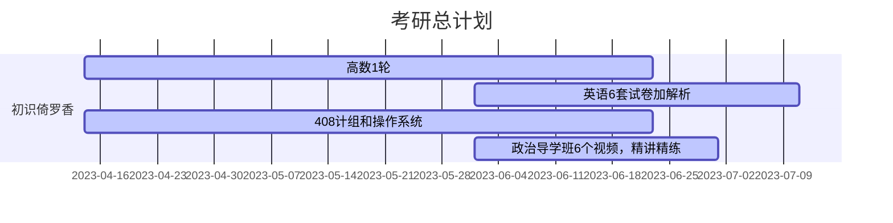

# KaoyanPlan

向日葵的考研计划

今日起兵，选择计算机11408绞肉机

学习管理，充分休息，不允许懈怠

一人一团队，兼职开发人员，测试人员，产品经理，项目经理

- [KaoyanPlan](#kaoyanplan)
  - [准则](#准则)
  - [周报](#周报)
  - [学习管理表](#学习管理表)
  - [学习节点](#学习节点)
  - [复试准备](#复试准备)
  - [参考仓库](#参考仓库)
    - [数学](#数学)
    - [英语](#英语)
    - [408](#408)

## 准则

- 作息
  - 早上 6 点起，6 点到 8 点晨练和早餐，中午 1 点到 2 点休息，晚上 11 点睡，睡眠充足，克服懈怠
  - 《成为作家》写作训练，早上和一个特定时间训练自己的无意识。
- 学习方法
  - 不要被单科线操作了，拒绝偏科，各科抓紧
  - 项目管理不需要太细，也不要设置太紧张，把握每个学习段的节点，将四科学习合理分配，重点放在数学和408上
  - 交叉学习数学，408，~~交叉学习英语和政治~~，前期大量投入到数学和408，越早模拟越好
  - 每天坚持英语的学习，之间穿插特殊训练，英语口语，听力的学习。可以做一点算法题训练提高数据结构的理解，但不要花费大量精力，复试再好好准备相关项目。
  - 前期（四月-七月）听课占 40%，学习占 60%，（八月-十二月）后期听课 20%，学习占 80%
- 学习管理
  - 每天 22 点记录日报，每周日 16 点记录周报，1，3，5 或者 2，4 早上 9 点审计学习进度，记录学习管理表

## 周报

  
周报详情

[第一周](周报/2023-04-16.md)

[第二周](周报/2023-04-23.md)

## 学习管理表

  
学习管理表详情

[v1.0.0](学习管理表/v1.0.0.md)

[v1.0.1](学习管理表/v1.0.1.md)

## 学习节点

## 复试准备

[N诺](https://noobdream.com/)

## 参考仓库

### 数学

[Math](https://github.com/Didnelpsun/Math)

### 英语

[KaoYan-English](https://github.com/m2kar/KaoYan-English)

[专为程序员编写的英语学习指南 v1.2](https://github.com/yujiangshui/A-Programmers-Guide-to-English)

### 408

[aimto408](https://github.com/xiaolei565/aimto408)

[CSPostgraduate-408](https://github.com/CodePanda66/CSPostgraduate-408)
