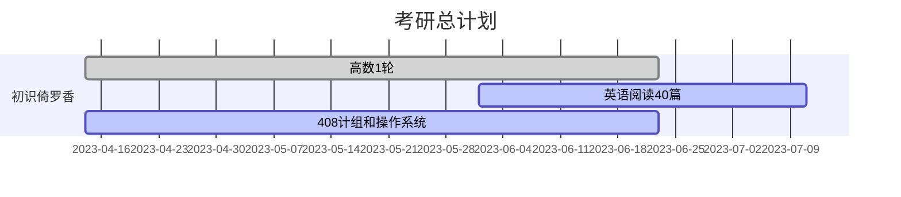
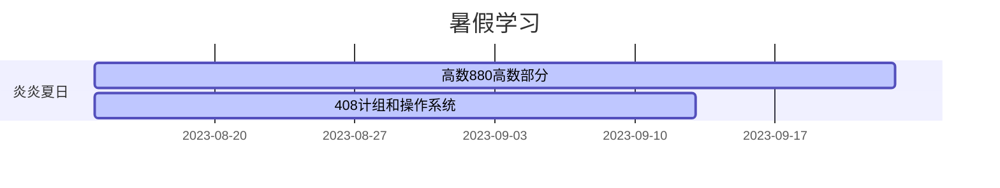

# KaoyanPlan

向日葵的考研计划

冲烂计算机11408

学习管理，充分休息，学习时间抓紧学

一人一团队，兼职开发人员，测试人员，产品经理，项目经理

不要愧对自己和亲朋好友

- [KaoyanPlan](#kaoyanplan)
  - [学习方法](#学习方法)
    - [政治](#政治)
    - [英语](#英语)
    - [数学](#数学)
    - [专业课](#专业课)
  - [准则](#准则)
  - [周报](#周报)
  - [月报](#月报)
  - [学习管理表](#学习管理表)
  - [学习节点](#学习节点)
  - [复试准备](#复试准备)
  - [参考仓库](#参考仓库)
    - [数学](#数学-1)
    - [英语](#英语-1)
    - [408](#408)

## 学习方法

### 政治

八月份听徐涛的课，刷选择题，十月背资料。

### 英语

识记考研大纲单词，练习考研的阅读和写作，除此之外，提高自己的造句和对话的能力

用“欧路词典”记单词，欧路词典提供了单词库记背，还有识别图片上的单词并添加到生词本的功能。

~~初期，每天一篇阅读，然后整理这一篇阅读的生词和好句，运用这些好词好句造句~~

~~先用中文把自己的想法写出来，然后用gpt翻译出来，体会想法用英语表达出来的感觉~~

阅读>作文>完型，每天一篇阅读记单词，后期再套作文模板

### 数学

全程跟着张宇学，按高数，概率论，线代的顺序复习，复习概率论的时候，每天保证高数的题量，巩固之前的知识体系。

刷张宇300题，李林880，最后再刷真题，不要怕写得慢，搞懂每个知识点才是重点

### 专业课

跟着王道网课走，按计组，操作系统，数据结构，计网的顺序复习，题目可以从王道书和n诺上面找。

9月15号之前过一遍，好好理解每一个知识点

## 准则

- 作息
  - 想象自己在当兵或者当和尚，没有手机只有学习，无学习以外信息摄入，无欲则刚，牢记初心，坚持100天
- 学习方法
  - 按自己的节奏来，不要被网上的经验贴吓跑，永远处于一个准备的状态，永远有东西要学，所以保持自己的学习节奏很重要 
  - 不要被单科线拦住了，拒绝偏科，各科抓紧
  - 项目管理不需要太细太紧张，把握每个学习段的节点，将四科学习合理分配，重点放在数学和408上
- 学习管理
  - 每天 22 点记录日报，每周日 16 点记录周报，~~1，3，5 或者 2，4 早上 9 点审计学习进度，记录学习管理表~~

## 周报

  
周报详情

[第一周 04-16](周报/2023-04-16.md)

[第二周 04-23](周报/2023-04-23.md)

[第三周 04-30](周报/2023-04-30.md)

[第四周 05-07](周报/2023-05-07.md)

[第五周 05-14](周报/2023-05-14.md)

[第六周 05-21](周报/2023-05-21.md)

[第七周 05-28](周报/2023-05-28.md)

[第八周 06-04](周报/2023-06-04.md)

[第九周 06-11](周报/2023-06-11.md)

## 月报

  
月报详情

[5月](月报/5月.md)

## 学习管理表

  
学习管理表详情

[v1.0.0](学习管理表/v1.0.0.md)

[v1.0.1](学习管理表/v1.0.1.md)

[v1.0.2](学习管理表/v1.0.2.md)

[v1.0.3](学习管理表/v1.0.3.md)

[v1.0.4](学习管理表/v1.0.4.md)

## 学习节点

## 复试准备

[N诺](https://noobdream.com/)

## 参考仓库

### 数学

[Math](https://github.com/Didnelpsun/Math)

### 英语

[KaoYan-English](https://github.com/m2kar/KaoYan-English)

[专为程序员编写的英语学习指南 v1.2](https://github.com/yujiangshui/A-Programmers-Guide-to-English)

[考研英语作文经验贴](https://zhuanlan.zhihu.com/p/71532090)

### 408

[aimto408](https://github.com/xiaolei565/aimto408)

[CSPostgraduate-408](https://github.com/CodePanda66/CSPostgraduate-408)

[cs-408](https://github.com/ddy-ddy/cs-408)